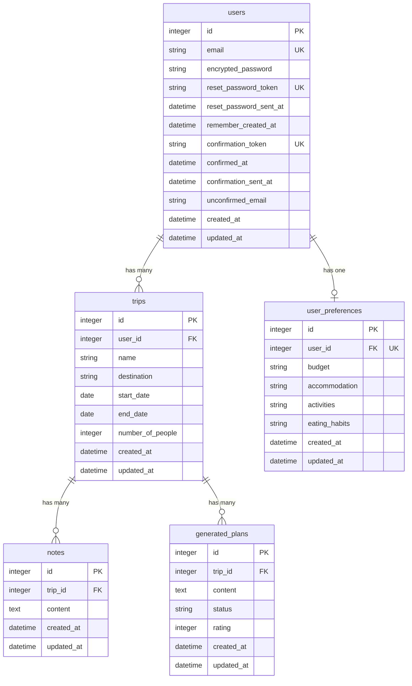

# TravelPlanner Database Schema

## 1. Tables with Columns, Data Types, and Constraints

### users
Managed by Devise gem - includes standard Devise columns:
- `id` (integer, primary key, auto-increment)
- `email` (string, not null, unique)
- `encrypted_password` (string, not null)
- `reset_password_token` (string, unique, nullable)
- `reset_password_sent_at` (datetime, nullable)
- `remember_created_at` (datetime, nullable)
- `confirmation_token` (string, unique, nullable)
- `confirmed_at` (datetime, nullable)
- `confirmation_sent_at` (datetime, nullable)
- `unconfirmed_email` (string, nullable)
- `created_at` (datetime, not null)
- `updated_at` (datetime, not null)

### trips
- `id` (integer, primary key, auto-increment)
- `user_id` (integer, not null, foreign key -> users.id)
- `name` (string, not null)
- `destination` (string, not null)
- `start_date` (date, not null)
- `end_date` (date, not null)
- `number_of_people` (integer, not null, default: 1)
- `created_at` (datetime, not null)
- `updated_at` (datetime, not null)

### notes
- `id` (integer, primary key, auto-increment)
- `trip_id` (integer, not null, foreign key -> trips.id)
- `content` (text, not null)
- `created_at` (datetime, not null)
- `updated_at` (datetime, not null)

### user_preferences
- `id` (integer, primary key, auto-increment)
- `user_id` (integer, not null, unique, foreign key -> users.id)
- `budget` (string, nullable)
- `accommodation` (string, nullable)
- `activities` (string, nullable)
- `eating_habits` (string, nullable)
- `created_at` (datetime, not null)
- `updated_at` (datetime, not null)

### generated_plans
- `id` (integer, primary key, auto-increment)
- `trip_id` (integer, not null, foreign key -> trips.id)
- `content` (text, not null)
- `status` (string, not null, default: 'pending')
- `rating` (integer, nullable)
- `created_at` (datetime, not null)
- `updated_at` (datetime, not null)

## 2. Relationships Between Tables

### Relationship Details:
- **users ↔ trips**: One-to-Many (one user has many trips)
- **users ↔ user_preferences**: One-to-One (one user has one preferences record)
- **trips ↔ notes**: One-to-Many (one trip has many notes)
- **trips ↔ generated_plans**: One-to-Many (one trip has many generated plans)

## 3. Indexes

### users table
- Primary key index on `id` (automatic)
- Unique index on `email` (for Devise authentication)
- Unique index on `reset_password_token` (for password reset)
- Unique index on `confirmation_token` (for email confirmation)

### trips table
- Primary key index on `id` (automatic)
- Index on `user_id` (foreign key, part of composite index below)
- Composite index on `(user_id, start_date)` (optimizes fetching user's trips chronologically)
- Index on `destination` (for destination-based queries)

### notes table
- Primary key index on `id` (automatic)
- Index on `trip_id` (foreign key, optimizes joins and filtering)

### user_preferences table
- Primary key index on `id` (automatic)
- Unique index on `user_id` (enforces one-to-one relationship and optimizes lookups)

### generated_plans table
- Primary key index on `id` (automatic)
- Index on `trip_id` (foreign key, optimizes fetching plans for a trip)
- Index on `status` (optimizes filtering by generation status)

## 4. PostgreSQL Policies (RLS)

**Not applicable for MVP**: As per session notes decision #9, Row-Level Security (RLS) will not be implemented for the MVP. Authorization and data access control will be handled at the application level using Rails.

## 5. Design Decisions and Notes

### Data Integrity
- **Cascading Deletes**: Managed at the application level (Rails associations with `dependent: :destroy`)
  - Deleting a user should cascade delete their trips, preferences, and indirectly their notes and plans
  - Deleting a trip should cascade delete its notes and generated plans
- **Date Validation**: `end_date > start_date` validation enforced at application level (Rails model validation)
- **Number of People**: Default value of 1, must be positive (validated at application level)

### Preference Management
- Predefined options (enums) for `budget`, `accommodation`, `activities`, and `eating_habits` will be managed at the application level
- Example values based on PRD:
  - **Budget**: 'budget-conscious', 'standard', 'luxury'
  - **Accommodation**: 'hotel', 'airbnb', 'hostel', etc.
  - **Activities**: 'outdoors', 'sightseeing', 'cultural', 'relaxation', etc.
  - **Eating Habits**: 'restaurants_only', 'self_prepared', 'mix'

### Generated Plans
- **Status values** (managed at application level): 'pending', 'generating', 'completed', 'failed'
- **Rating**: Integer 1-10, nullable (not rated until user provides feedback)
- Rating range validation (1-10) will be enforced at application level
- Multiple plans can be generated for the same trip (supporting regeneration)

### Security Approach
- Authentication via Devise (email/password with confirmation)
- Authorization logic in Rails controllers/policies to ensure:
  - Users can only access their own trips, notes, preferences, and plans
  - Users cannot access or modify other users' data
- No database-level RLS for MVP simplicity

### Scalability Considerations
- Text fields (`notes.content`, `generated_plans.content`) acceptable for MVP scale
- Composite index on `trips(user_id, start_date)` optimizes most common query pattern
- Foreign key indexes ensure efficient joins
- Future optimization opportunities:
  - Full-text search indexes if search functionality is added
  - Partitioning for large tables if scale demands
  - Caching strategies at application level

### Rails Integration
- Standard Rails conventions followed:
  - `id` as primary key
  - `created_at` and `updated_at` timestamps
  - Snake_case naming
  - Foreign keys named as `{table}_id`
- Devise handles `users` table structure
- Models will use:
  - `has_many`, `belongs_to`, `has_one` associations
  - Validations for data integrity
  - Callbacks for complex business logic

### Normalization
- Schema is in Third Normal Form (3NF)
- No denormalization needed for MVP
- Separate tables for distinct entities prevent data redundancy
- User preferences in dedicated table allows easy updates without affecting other data

### Missing Constraints (Intentional)
As per session decisions, these are NOT implemented at database level:
- Check constraints for rating range (1-10)
- Check constraint for `end_date > start_date`
- Foreign key cascade delete actions
- Enum constraints for preference columns

These will be handled by Rails validations and associations for flexibility during MVP development.

